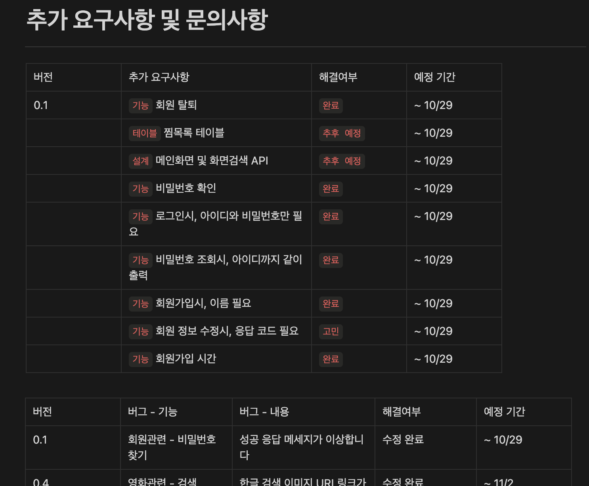

# MiniProject

<p align="center">

</p>  

<div align="center">

[](https://hits.seeyoufarm.com)

</div>

<br>

## 01. MovieScript 
> 학원 미니 프로젝트
>
> 개발 기간 : 2022.10 ~ 2022.11  

<br>

### 배포 주소
> http://www.moviescript.site  

<br>


### 개발팀 소개
|백엔드|프론트엔드|프론트엔드|프론트엔드|프론트엔드|
|:-----:|:-----:|:-----:|:-----:|:-----:|
| |||||
|[GomDiing](https://github.com/GomDiing)|[hjm8727](https://github.com/hjm8727)|[hrhr7](https://github.com/hrhr7)|[jimin0601](https://github.com/jimin0601)|[Ryel1580](https://github.com/Ryel1580)|  

<br>

### 프로젝트 소개
비회원도 영화 정보를 열람할 수 있는 해외 사이트 [IMDB](https://www.imdb.com/)에서 아이디어 착안했습니다. 영화를 추천받고 관련 정보와 리뷰를 볼 수 있는 사이트를 목표로 한 프로젝트입니다.

<br>

## 02. 시작 가이드

> [!CAUTION]
> 보안 문제로 Backend & Frontend & Python 설정 파일을 업로드하지 않았습니다.  
> 제대로 작동하지 않으니 [배포 주소](#배포-주소)로 접속해주세요.


### 요구사항
해당 프로젝트는 다음과 같은 Application이 필요합니다.
- npm
- Node.js
  
#### 설치

```
$ git clone https://github.com/GomDiing/Kh_Miniproject.git  
$ cd Kh_Miniproject
```  

#### Backend
```
$ cd spring
$ ./gradlew build
$ cd build/libs
$ java -jar demo-0.0.1-SNAPSHOT.jar
```
 
#### Frontend
```
$ cd frontend
$ npm install
$ yarn start
```

#### Python
````
$ cd python
$ pip3 install requests flask sqlalchemy==1.4.4 apscheduler mysql-connector
$ python apiMain.py
````

<br>

## 03. 기술 스택
<h3 align="left"> Tools </h3>
<div align="left">
&nbsp
&nbsp
&nbsp
&nbsp
&nbsp
&nbsp
</div>

<h3 align="left"> Frontend </h3>
<div align="left">
&nbsp
&nbsp
&nbsp
&nbsp
&nbsp
</div>

<h3 align="left"> Backend </h3>
<div align="left">
&nbsp
&nbsp
&nbsp
&nbsp
&nbsp
&nbsp
</div>

<h3 align="left"> Deploy </h3>
<div align="left">
&nbsp
&nbsp
</div>

<br>

## 04. 화면 구성
|메인 페이지|영화 페이지|
|:---:|:---:|
|||
|조회 페이지|리뷰 페이지|
||

<br>

## 05. API 주소

> [!NOTE]
> API 문서는 [해당 링크](https://telling-list-c32.notion.site/API-44cc96085fb246f6a5c635ece5276122)에서 자세히 보실 수 있습니다.

|API 목차|API 상세|
|:---:|:---:|
|||
|API 히스토리|API 요구사항|
|||

<br>

## 06. 주요 기능
1. 카테고리별 분류를 통한 영화 추천
    - 최신 / 인기 / 최고 평점 / 개봉 예정작 4개 카테고리를 분류
    - 각 카테고리별 추천 영화 
2. 비회원도 무료로 사용 가능
    - 기본적인 기능은 비회원인 상태에서도 사용 가능
3. 리뷰 작성 기능 제공
    - 회원 가입 기능을 통해 리뷰 작성 가능

<br>

## 07. 아키텍쳐
<div align="center">

</div>

```
.
├── md_attachment       // README 첨부파일 폴더
├── python              // Python 폴더, TMDB API 서버 기능
├── react               // Frontend 폴더
│   ├── public
│   └── src 
│       ├── api
│       ├── images
│       ├── pages
│       │   ├── Cards
│       │   ├── Category
│       │   ├── Login
│       │   ├── MainPage
│       │   ├── Menu
│       │   └── MyPage
│       └── util
└── spring              // Backend 폴더
    ├── build
    ├── gradle
    └── src             // Spring 소스코드
        └── main/java/comprehensive/demo
            └── demo
                ├── controller     
                ├── dto             
                ├── entity
                ├── exception       // 예외처리
                ├── interceptor     // 로그 기록
                ├── repository
                ├── response        // 응답
                ├── service
                ├── test
                └── vo

```

<br>

## 08. 개발 문서
### ERD 다이어그램
<div align="center">

</div>

### 플로우차트
<div align="center">

</div>

### 프로세스 회원가입
<div align="center">

</div>


### 프로젝트 진행도

> [!NOTE]
> 프로젝트 진행도는 [해당 링크](https://telling-list-c32.notion.site/5510047431ae46a5b029100433bb5679?pvs=25)에서 자세히 보실 수 있습니다.


### 프로젝트 회고

> [!NOTE]
> 프로젝트 회고는 [해당 링크](https://gomdiing.github.io/miniproject/miniproject_artifact/)에서 자세히 보실 수 있습니다.

